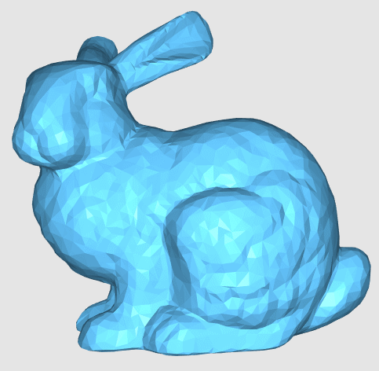
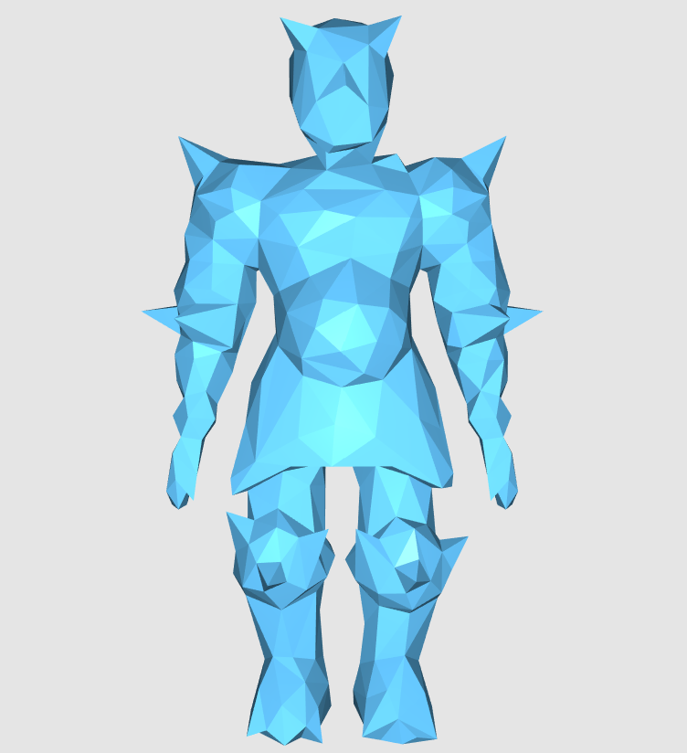
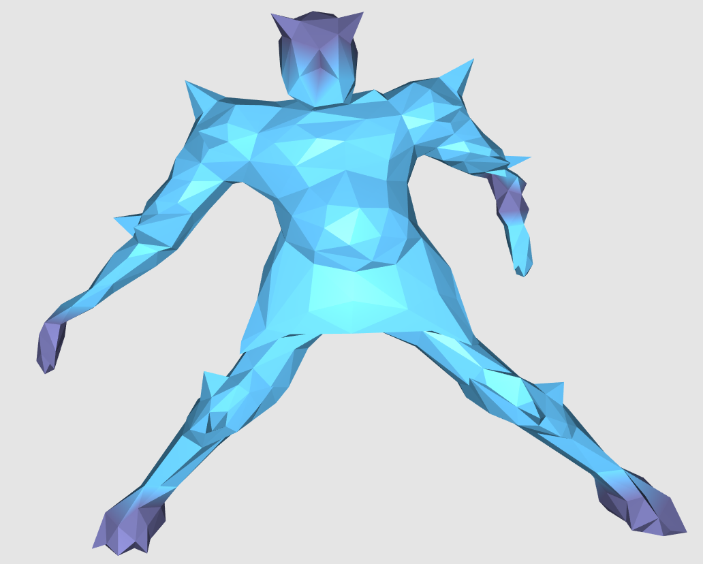
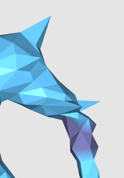
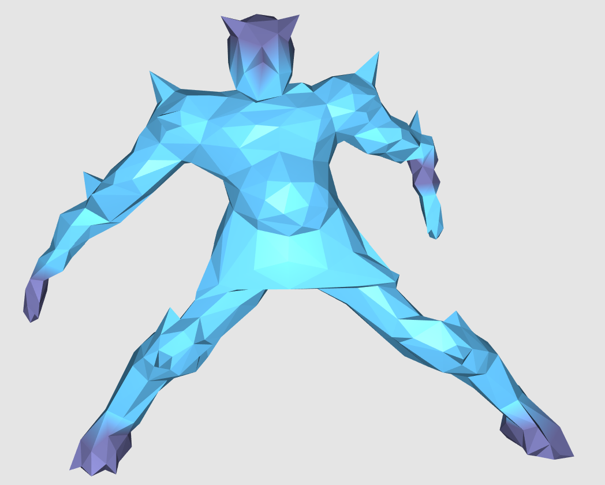
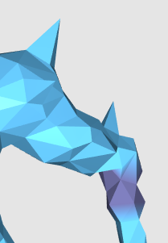

# advanced-computer-graphics-geometry
HKUST 2019-2020 Fall COMP5411 (geometry part)

## Setup
1. open CMake
2. browse source (MeshViewer/) and destination
3. click Configure
4. click Generate
5. open generated .sln in Visual Studio
8. switch to Release mode
7. right click the project in Solution Explorer and select build

## Assignment 0
1. count boundary loops in the mesh
2. count connected components in the mesh
3. compute vertex normal

## Assignment 1
### Explicit/implicit Laplacian smoothing with uniform/cotangent weights

Core functions: Mesh::umbrellaSmooth, Mesh::implicitUmbrellaSmooth

Output:

|               | Explicit (λdt=1)    | Implicit (λdt=10)   |
| :-----------: | :-----------------: | :-----------------: |
| **Uniform**   |  |  |
| **Cotangent** |  |  |

Reference:
- Desbrun et al. 1999. Implicit Fairing of Irregular Meshes using Diffusion and Curvature Flow

## Assignment 2
### Laplacian surface editing

Extra: rotation invariant

Core functions: Deformer::buildSystemMat, Deformer::deform

Output:
<table>
  <tr>
  <th colspan="2">Original</th>
  </tr>
  <tr>
    <td colspan="2">
      

    </td>
  </tr>
  <tr>
    <th>Naive</th>
    <th>Rotation invariant</th>
  </tr>
  <tr>
    <td>
      
  

    </td>
    <td>
 (only works for small resolution details)
</td>
  </tr>
</table>

Reference:
- Lipman et al. 2004. Differential Coordinates for Interactive Mesh editing
- Sorkine et al. 2004. Laplacian Surface Editing